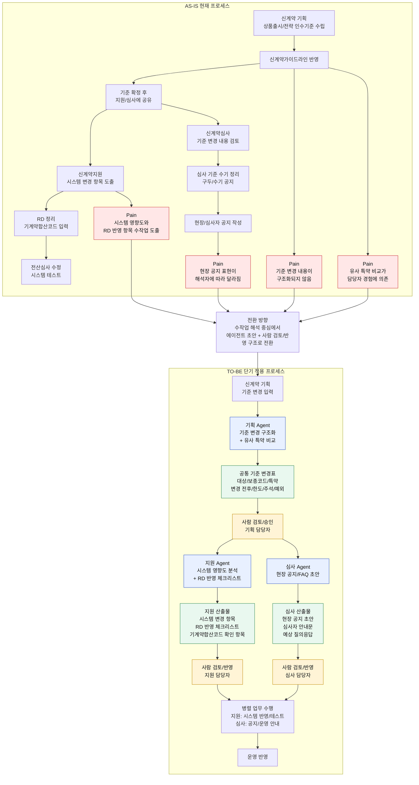

# 신계약 기준 반영 협업 Agent Pack 기획서

## 1페이지 요약

| 항목 | 내용 |
|---|---|
| Agent 이름 | 신계약 기준 반영 협업 Agent Pack 기획 Agent + 지원 Agent + 심사 Agent |
| 문제 정의 | 신계약 기준 변경이 발생하면 기획, 지원, 심사 부서가 병렬로 업무를 수행하지만, 현재는 기준 변경 내용, 유사 특약 비교, 시스템 영향도, RD 반영 항목, 현장 공지 문구가 담당자 수작업과 경험에 의존한다. 그 결과 같은 변경 건에 대해 부서별 해석 차이, 누락, 재작업이 발생할 수 있다. |
| 대상 사용자/JTBD | 대상 사용자: 신계약 기획 담당자, 신계약지원 담당자, 신계약심사 담당자 JTBD: 한 가지 기준 변경이 발생했을 때 각 부서가 같은 기준을 바탕으로 해석 오류 없이 일관되게 반영할 수 있도록, 필요한 초안과 체크리스트를 빠르게 확보하고 싶다. |
| 핵심 기능 1 | 기획 Agent: 기준 변경 구조화 + 유사 특약 비교 상품출시 또는 전략 인수기준 변경 내용을 대상 상품, 보종코드, 특약, 변경 전/후, 한도, 주석, 예외조건으로 구조화하고, 기존 유사 특약과 비교해 복사 가능 항목과 검토 필요 항목을 표시한다. |
| 핵심 기능 2 | 지원 Agent: 시스템 영향도 분석 + RD 반영 체크리스트 구조화된 기준 변경표를 바탕으로 시스템 변경 필요 항목, RD 반영 항목, 기계약합산코드 확인 항목, 전산심사 영향 후보를 체크리스트로 생성한다. |
| 핵심 기능 3 | 심사 Agent: 현장 공지/FAQ 초안 생성 확정된 기준 변경 내용을 현장과 심사자가 이해할 수 있는 표현으로 바꾸고, 공지문 초안, 심사자 안내문, 예상 질의응답을 생성한다. |
| 안 만들 것 | 인수기준 최종 결정 자동화, 심사 판단 자동화, RD 직접 입력 자동화, 시스템 반영 자동 승인, 전산 반영 자동 승인, 현장 공지 자동 발송, 고객 또는 현장 대상 무승인 커뮤니케이션 |
| 입력 데이터 | 판매예규, 보종코드, 신계약가이드라인, 기존 유사 특약 기준, 신규 특약 한도/주석, 전략 인수기준 변경 내용, RD 양식, 시스템 반영 항목, 기존 현장 공지/FAQ 예시 |
| 출력 형식 | 기준 변경표, 유사 특약 비교표, 시스템 영향도 목록, RD 반영 체크리스트, 기계약합산코드 확인 항목, 현장 공지 초안, 심사자 FAQ 초안 |
| 사람 승인 지점 | 기획 Agent 출력: 기획 담당자가 기준 변경표와 유사 특약 비교 결과 승인 지원 Agent 출력: 지원 담당자가 RD 반영 체크리스트와 시스템 영향도 목록 승인 심사 Agent 출력: 심사 담당자가 공지/FAQ 발송 전 승인 |
| 완료 정의 | 기준 변경 1건에 대해 1. 기준 변경표 2. 유사 특약 비교표 3. 시스템 영향도 목록 4. RD 반영 체크리스트 5. 현장 공지/FAQ 초안이 생성되고, 각 부서 담당자가 검토·승인할 수 있는 상태가 되면 완료 |
| 고객 영향·판단 단계 | 내부 운영 기준과 현장 안내에 영향을 주는 단계다. 최종 인수기준 결정, 심사 판단, 시스템 반영 승인, 공지 발송은 반드시 사람이 수행한다. |
| 보류 이유 | 심사 기준 자동 판단, RD 직접 입력, 전산 반영 자동화는 오류 발생 시 업무 리스크가 커서 단기 범위에서 제외한다. 먼저 초안 생성, 영향도 분석, 체크리스트 보조 영역부터 적용한다. |
| 왜 지금 만드는지 한 줄 | 한 가지 기준 변경에 대해 각 부서가 해석 오류 없이 일관되게 반영할 수 있도록, 사람이 승인 가능한 초안과 체크리스트를 먼저 자동 생성한다. |

## AS-IS / TO-BE 프로세스

## 예상 질문 및 답변 키워드

| No. | 관점 | 예상 질문 | 답변 키워드 |
|---:|---|---|---|
| 1 | 약한 가정 | 에이전트가 기준 변경을 정확히 구조화할 수 있는가? | 최종 판단이 아니라 초안 작성 목적. 사람의 수정과 최종 반영을 전제로 운영. |
| 2 | 약한 가정 | 유사 특약 비교 결과를 그대로 믿어도 되는가? | 비교 결과는 참고 후보. 복사·반영 여부는 기획 담당자가 승인. |
| 3 | 약한 가정 | 자동화 범위가 과도하게 넓어지는 것은 아닌가? | "안 만들 것"에 자동 판단, 직접 입력, 자동 승인 제외 범위를 명시. |
| 4 | 테스트 방법/데이터 | 어떤 데이터로 테스트할 수 있는가? | 가이드라인 샘플, 보종코드, RD 양식, 기존 공지문 샘플 활용. |
| 5 | 테스트 방법/데이터 | 성능은 어떻게 측정하는가? | 원천 데이터와 초안을 비교. 누락, 오분류, 수정 필요 문장 비율, 담당자 승인 가능 여부 확인. |
| 6 | 예상 비용 | 월 사용량은 어떻게 가정하는가? | 상품 2개 출시 기준, Agent Pack 전체 월 10회 사용 가정. |
| 7 | 예상 비용 | 입력 데이터 크기는 어느 정도인가? | 가이드라인 1개 시트, 17열 x 600행 엑셀 기준. |
| 8 | 예상 비용 | 월 비용은 어느 정도인가? | 저추론 작업이라 고성능 모델 불필요. 저비용 모델 기준 월 $1~$3, 재실행·검증 포함 초기 파일럿 월 $5 이하 추정. |
| 9 | 보안/보완 위협 | 내부 문서가 외부 모델 또는 로그에 남는 위험은 어떻게 보는가? | 내부망 사용 구조라면 일부 우려 완화. 회사 보안 방향성과 함께 별도 설계 필요. |
| 10 | 보안/보완 위협 | 단기 통제는 무엇을 둘 수 있는가? | 민감정보 최소 입력, 문서 권한 관리, 원문 로그 저장 제한, 담당자 승인 게이트. |
| 11 | 사람 개입 시점/역할 | 사람이 언제 개입하는가? | 에이전트 초안 작성 후 사람이 반드시 검토, 수정, 반영. |
| 12 | 사람 개입 시점/역할 | 부서별 사람 역할은 무엇인가? | 기획: 기준 변경표·유사 특약 비교 검토. 지원: 시스템 영향도·RD 체크리스트 검토. 심사: 공지·FAQ 초안 검토. |
| 13 | 사람 개입 시점/역할 | 에이전트의 역할은 어디까지인가? | 판단자가 아니라 초안 작성 보조자. |
